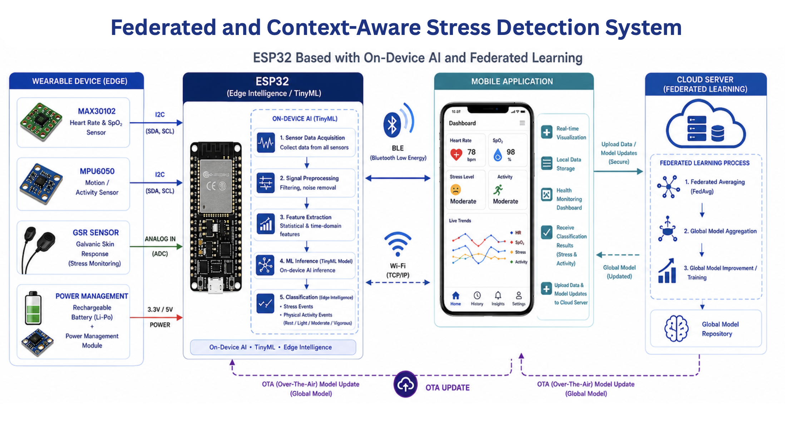

# Federated & Context-Aware Stress Detection System

An IoT and machine learning based stress detection system that combines multimodal physiological signals, motion data, embedded processing, and federated learning to distinguish stress-related responses from physical activity.

The project was developed as a major project for the B.Tech program in Electronics and Telecommunication Engineering at SGSITS, Indore.

---

## Overview

Stress and physical activity can produce similar physiological responses, such as increased heart rate, body temperature, and movement. This can lead to false stress detections when a system relies on a single physiological signal.

This project explores a multimodal approach using physiological and motion signals to provide context-aware stress detection.

The proposed system combines:

- ESP32-based sensor acquisition
- Physiological and motion signals
- Signal preprocessing and feature extraction
- Machine learning-based classification
- Random Forest model deployment
- Federated Learning using Federated Averaging (FedAvg)
- Streamlit-based simulation and visualization

The overall system architecture is based on the workflow described in the project report: sensor acquisition → ESP32 processing → feature extraction → machine learning inference → monitoring, with a federated learning layer for collaborative model training.

---

## System Architecture



```text
             Physiological & Motion Sensors
                       │
                       ▼
                  ┌─────────┐
                  │  ESP32  │
                  └────┬────┘
                       │
                       ▼
             Signal Preprocessing
                       │
                       ▼
              Feature Extraction
                       │
                       ▼
             Machine Learning Model
                       │
                       ├───────────────► Stress / Activity
                       │
                       ▼
              Monitoring / Dashboard

                       │
                       ▼
              Federated Learning

        ┌──────────────┼──────────────┐
        ▼              ▼              ▼
     Client 1       Client 2       Client N
        │              │              │
        └──────────────┼──────────────┘
                       ▼
                 FedAvg Server
                       │
                       ▼
                  Global Model
```

---

## Hardware

The prototype is based around an ESP32 and physiological/motion sensors.

| Component          | Purpose                                                        |
| ------------------ | -------------------------------------------------------------- |
| ESP32              | Sensor interfacing, processing and wireless communication      |
| MAX30102           | Heart rate and SpO₂ / PPG acquisition                          |
| MPU6050            | Accelerometer and gyroscope data for motion/activity detection |
| GSR / EDA sensor   | Electrodermal activity measurement                             |
| Temperature sensor | Temperature measurement where available                        |

---

## Machine Learning Pipeline

The machine learning workflow consists of:

1. Data acquisition
2. Signal preprocessing
3. Window-based segmentation
4. Feature extraction
5. Model training
6. Model evaluation
7. Embedded inference
8. Federated learning simulation

The WESAD (Wearable Stress and Affect Detection) dataset was used for model development and evaluation.

### Features

The project uses physiological and motion characteristics such as:

- Heart rate
- Heart rate variability
- EDA statistics
- Temperature statistics
- Accelerometer statistics
- Signal variation and trends

These features are extracted from segmented physiological signals before being passed to the classification models.

---

## Model Comparison

Several machine learning approaches were evaluated during the project.

| Model                | Reported Accuracy |
| -------------------- | ----------------: |
| Dummy Classifier     |            32.14% |
| Logistic Regression  |               84% |
| Decision Tree        |            89.28% |
| Neural Network (MLP) |               93% |
| **Random Forest**    |        **97.68%** |

Random Forest achieved the best reported performance among the evaluated models.

### Selected Model

The deployed model is:

```text
Random Forest Classifier
├── 200 decision trees
├── Maximum depth: 10
└── Random state: 42
```

The trained model is provided in the `models/` directory, while the tree structure used for ESP32 inference is provided as C++ source code.

---

## Federated Learning

The project incorporates Federated Learning to explore privacy-preserving collaborative model training.

Instead of transferring raw physiological data to a central server:

```text
Local Data
    ↓
Local Model Training
    ↓
Model Parameters / Updates
    ↓
Central Aggregation
    ↓
FedAvg
    ↓
Global Model
    ↓
Distributed Back to Clients
```

The project uses Federated Averaging (FedAvg) as the aggregation approach.

The repository also contains a Streamlit-based simulation of the federated learning workflow. The simulation represents multiple clients locally and demonstrates local training, parameter aggregation, and global model updates.

> **Note:** The federated learning component in this repository is a simulation/prototype rather than a production deployment across physically distributed devices.

---

## ESP32 Deployment

The trained Random Forest model was converted into a C/C++ representation for embedded inference.

The ESP32 implementation contains:

```text
esp32/
├── esp32_stress_rf.ino
├── rf_model.cpp
├── rf_model.h
└── README.md
```

The `.pkl` and `.joblib` files are used for Python/scikit-learn model storage, while `rf_model.cpp` and `rf_model.h` contain the representation used by the ESP32 implementation.

### Sensor Processing

The ESP32 prototype collects:

- PPG-derived heart-rate information
- Motion data from MPU6050
- EDA/GSR measurements
- Temperature information where available

The extracted features are passed to the embedded Random Forest model to generate a prediction.

---

## Streamlit Simulation

The repository includes a Streamlit application for demonstrating the federated learning workflow without requiring multiple physical edge devices.

```text
simulation/
├── app.py
├── clients.pkl
├── data_for_app.npz
├── global_checkpoint.pth
├── global_meta.pkl
└── requirements.txt
```

Run the simulation with:

```bash
cd simulation

pip install -r requirements.txt

streamlit run app.py
```

---

## Repository Structure

```text
federated-stress-detection/
│
├── README.md
├── LICENSE
├── .gitignore
│
├── docs/
│   ├── project-report.pdf
│   └── project-architecture.png
│
├── notebooks/
│   └── wesad-data-analysis.ipynb
│
├── models/
│   ├── random_forest_model.pkl
│   ├── random_forest_model.joblib
│   └── model_metadata.json
│
├── esp32/
│   ├── esp32_stress_rf.ino
│   ├── rf_model.cpp
│   ├── rf_model.h
│   └── README.md
│
├── simulation/
│   ├── app.py
│   ├── clients.pkl
│   ├── data_for_app.npz
│   ├── global_checkpoint.pth
│   ├── global_meta.pkl
│   └── requirements.txt
│
└── scripts/
    └── verify_model.py
```

---

## Dataset

This project uses the:

**WESAD — Wearable Stress and Affect Detection Dataset**

The dataset contains multimodal physiological signals collected for stress and affect detection research.

The dataset itself is **not included in this repository**.

To reproduce the machine learning experiments, download the WESAD dataset separately and configure the dataset path in the notebook.

---

## Reproducing the ML Pipeline

The complete model development workflow is available in:

```text
notebooks/wesad-data-analysis.ipynb
```

The notebook covers:

- WESAD data loading
- Signal inspection
- Preprocessing
- Feature extraction
- Dataset preparation
- Model training
- Model comparison
- Random Forest evaluation
- Federated learning experimentation

---

## Results

The project report reports a Random Forest accuracy of approximately:

```text
97.68%
```

The Random Forest model outperformed the other evaluated models in the reported experiments.

---

## Limitations

This project is a prototype and has several limitations.

- The WESAD dataset is collected under controlled experimental conditions.
- Model performance may differ when applied to real-world users and sensor hardware.
- Physiological responses vary significantly between individuals.
- The federated learning implementation included in the repository is a simulation rather than a production distributed deployment.
- Embedded sensor measurements may differ from the signals used during model training.
- Further validation with larger and more diverse datasets is required before real-world healthcare use.

---

## Future Work

Potential extensions include:

- CNN-LSTM or other temporal deep learning models
- Larger and more diverse datasets
- Improved personalization
- Real-time cloud dashboards
- Mobile application integration
- More physiological sensors
- Improved embedded inference
- Deployment across multiple physical edge devices
- More extensive federated learning experiments

---

## Technologies

### Hardware

- ESP32
- MAX30102
- MPU6050
- GSR / EDA sensor
- Temperature sensor

### Machine Learning

- Python
- NumPy
- Pandas
- Scikit-learn
- PyTorch
- Random Forest
- Federated Averaging (FedAvg)

### Embedded

- Arduino / ESP32
- C++
- I²C
- Wi-Fi

---


Department of Electronics and Telecommunication Engineering  
Shri Govindram Seksaria Institute of Technology and Science (SGSITS), Indore  
Academic Year 2025–2026

---

## Disclaimer

This project is an academic prototype for research and demonstration purposes. It is not a medical diagnostic system and should not be used for clinical decision-making.
